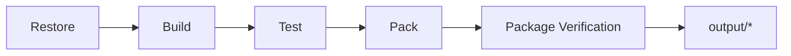

# AtomUI.City.Build Architecture

## 架构目标

AtomUI.City.Build 定义仓库级和包级工程约束，保证本地构建、CI、pack、source generator 分发和插件打包具有相同输出结构和失败语义。

- 所有构建产物集中到 `output`。
- 运行时包、测试包、generator 包和插件包边界清晰。
- 工程门禁可以用自动化测试验证，而不是依赖人工记忆。

## 核心不变量

- 运行时项目不得依赖 `AtomUI.City.Testing`、Roslyn analyzer runtime 或测试框架。
- Generator 包只作为 analyzer 分发，输出路径固定为 `analyzers/dotnet/cs`。
- NuGet pack warning、license metadata 缺失、输出路径逃逸必须失败。
- 构建规则必须支持 CI、非交互命令和本地开发一致执行。

## 核心概念和所有权

| 概念 | 职责 | 创建者 | 释放/失效规则 |
| --- | --- | --- | --- |
| OutputLayout | 定义 artifacts、packages、test-results、logs 的目录结构。 | MSBuild props/targets | 每次构建可清理重建。 |
| PackageContract | NuGet metadata、license、symbol、analyzer layout 和 dependency group。 | project file 和 Directory.Build.* | pack 时冻结为 nupkg 内容。 |
| ProjectInventory | 记录 src/tests/docs 的项目边界。 | Build tests | 项目增删时必须更新验证。 |
| EngineeringGate | format、docs、license、dependency、pack、test 的门禁集合。 | CI 和 Build tests | 任一失败阻止发布。 |

## 构建流程

## 失败矩阵

| 场景 | 行为 | 必须测试 |
| --- | --- | --- |
| 输出写到仓库散落目录 | 构建或测试失败。 | OutputLayoutTests |
| 运行时包依赖 Testing | 依赖边界测试失败。 | ProjectDependencyBoundaryTests |
| generator 包未放入 analyzer 路径 | pack 验证失败。 | SourceGeneratorProjectStructureTests |
| package metadata 缺失 LGPL v3 或 repository 信息 | pack gate 失败。 | PackageMetadataTests |
| 文档规则失败 | CI 阻止合并。 | EngineeringGateTests |

## 扩展点模型

Build 模块的扩展点不是运行时插件扩展点，而是工程输入：MSBuild property、target、project convention、pack layout 和测试门禁。新增扩展点必须同时更新 [features.md](features.md)、[api-contracts.md](api-contracts.md)、[testing.md](testing.md) 和相关工程脚本。

## AOT 和 Trimming 约束

Build 模块必须验证运行时包没有把 generator、testing、Roslyn 编译期依赖带入 runtime closure。AOT 相关警告策略、trimming annotations 和 generator analyzer 分发规则属于发布门禁。
