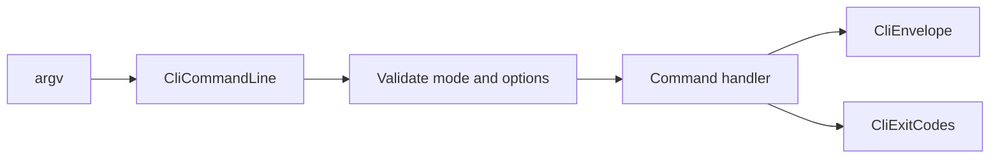

# AtomUI.City.Cli Architecture

## 架构目标

AtomUI.City.Cli 是 `atomui city` 命令入口，负责把模板创建、构建、测试、诊断、插件检查和 AI 友好输出串成可自动化的开发体验。

- 命令协议稳定，适合人工终端、CI 和 AI agent 调用。
- 非交互模式不会等待输入。
- JSON 输出和人类可读日志完全隔离。

## 核心不变量

- 命令入口固定为 `atomui city`。
- 每个命令必须有稳定 exit code、diagnostic code 和机器可读 envelope。
- `--json` 输出只能写 JSON envelope，普通日志写 stderr 或被禁止。
- CLI 不承载框架运行时逻辑，只调用 Templates、Build、PluginSystem、Testing 等模块 contract。

## 核心概念和所有权

| 概念 | 职责 | 创建者 | 释放/失效规则 |
| --- | --- | --- | --- |
| CliApplication | 命令分发和全局选项处理。 | Program | 进程退出释放。 |
| CliCommandLine | 解析 command、option、argument 和模式。 | CliApplication | 单次调用只读。 |
| CliEnvelope | 机器可读结果、diagnostics 和 artifact 列表。 | 命令处理器 | 输出后不可变。 |
| DotnetInvocation | 调用 dotnet build/test/pack 的进程 contract。 | 命令处理器 | 子进程结束释放。 |
| CliExecutionEnvironment | CI、非交互、工作目录和环境变量。 | CliApplication | 单次调用只读。 |

## 命令流程

## 失败矩阵

| 场景 | 行为 | 必须测试 |
| --- | --- | --- |
| 未知命令或非法参数 | 返回 usage diagnostic 和 InvalidArguments exit code。 | CliCommandArchitectureTests |
| CI/非交互需要确认 | 直接失败，不读 stdin。 | CliCommandArchitectureTests |
| dotnet 子进程失败 | 保留 stdout/stderr 摘要和 exit code。 | CliBuildAndTestCommandTests |
| `--json` 混入普通日志 | 测试失败。 | CliInspectDoctorPluginTests |
| AI 模式请求结构化计划 | 输出稳定 schema，不包含终端颜色控制字符。 | CliCommandArchitectureTests |

## AI 友好支持

CLI 的 AI 支持是协议能力，不是聊天能力。命令必须能输出：下一步建议、文件变更列表、diagnostics、artifacts、可重试命令和失败上下文。AI agent 可以根据 envelope 决定继续修复、运行测试或停止请求人工决策。

## AOT 和 Trimming 约束

CLI 可以作为独立工具发布。命令发现不依赖运行时反射扫描作为唯一机制；模板、插件 manifest 和 project inspection 优先读取静态文件或 generated manifest。
