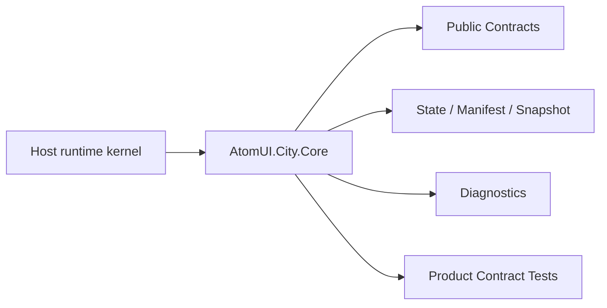

# AtomUI.City.Core Architecture

## 架构目标

AtomUI.City.Core 的架构目标是把模块职责变成可实现、可测试、可 review 的产品级合同。

- 提供应用运行时唯一根对象和构建入口。
- 用显式生命周期管线约束启动、运行、停止和释放。
- 让模块通过一致的配置、服务注册、初始化和关闭阶段接入 Host。
- 保持 UI 无关、AOT 友好、可测试。

## 核心不变量

- Core 不允许引用 Avalonia、AtomUI、Roslyn、CLI、Templates 或 Testing 生产程序集。
- ApplicationHostBuilder Build 后必须冻结服务注册入口。
- IApplicationContext 是 Build 阶段一次性创建的不可变应用实例描述符，不持有配置、服务容器、Scope、诊断或动态属性袋。
- LifecyclePipeline stage 顺序必须稳定，同一 stage 内 middleware 顺序必须稳定。
- StartAsync、StopAsync、DisposeAsync 和 Dispose 必须有明确幂等规则。
- 模块配置阶段禁止 BuildServiceProvider 和运行期服务解析。
- IUiDispatcher 只定义抽象，Core 不提交真实 UI work。

## 核心概念和所有权

| 概念 | 职责 | 创建者 | 释放/失效规则 |
| --- | --- | --- | --- |
| ApplicationHost | 用户入口，创建 ApplicationHostBuilder。 | 调用方 | 静态入口无释放。 |
| ApplicationHostBuilder | 收集 options、services、modules 和 lifecycle middleware。 | ApplicationHost.CreateBuilder | Build 后冻结，不可继续注册。 |
| DefaultApplicationHost | 持有 GenericHost、IApplicationContext、diagnostics 和生命周期状态。 | ApplicationHostBuilder.Build | Stop 后由 Dispose/DisposeAsync 释放；Context 在 Host 释放后仍可读取。 |
| LifecyclePipeline | 按 LifecycleStage 执行 middleware。 | Builder 构建阶段 | 随 Host 释放。 |
| LifecycleScope | 表达 application、module、plugin contribution、operation 等所有权。 | Host 或 parent scope | leaf-first 释放，重复释放幂等。 |
| ModuleBase | 模块接入配置、服务注册、初始化和关闭阶段。 | 模块注册或 DI | 由 Host module lifecycle 管理。 |
| IUiDispatcher | UI 调度抽象。 | Presentation 替换真实实现 | Core 默认 Unavailable。 |

## 产品级状态机

- Builder: Created -> Configuring -> Built -> Frozen
- Host: Created -> Starting -> Running -> Stopping -> Stopped -> Disposed
- Host failure: Starting -> Faulted -> Stopping -> Stopped 或 Disposed
- LifecycleScope: Running -> Stopping -> Stopped/Faulted -> Disposing -> Disposed
- Module: Declared -> ServicesConfigured -> Initialized -> Shutdown

## 关键运行流程

- CreateBuilder 收集 options、module registration、service actions 和 middleware。
- Build 验证应用身份与路径、创建不可变 IApplicationContext、GenericHost、LifecycleScope root 和 diagnostics collector。
- StartAsync 合并并发启动事务，依次启动 GenericHost、创建 Application ServiceScope 和 ApplicationScope、配置 contribution、执行 module initialization 和 lifecycle middleware。
- StopAsync 合并并发停止事务，调用方 cancellation 只取消等待；内部按 shutdown deadline 取消 operation、逆序关闭模块、释放 Application ServiceScope 并停止 GenericHost。
- DisposeAsync 从 leaf scope 到 root scope 释放，释放异常进入 diagnostics。

启动失败时，Host 保留原始异常并进入 Faulted；已经进入运行阶段的模块按逆拓扑顺序补偿关闭。关闭和释放阶段记录所有失败、继续处理剩余 owner，最后通过 AggregateException 汇总。

## 失败矩阵

- 模块依赖循环：Build 失败，诊断包含 cycle path。
- 重复 module id：Build 失败，诊断包含已有 module 和重复 module。
- lifecycle middleware 抛异常：当前 stage 失败，Host 进入 Faulted 并执行清理。
- Build 后继续注册服务：抛 InvalidOperationException 或返回失败 Result。
- UnavailableUiDispatcher 被执行：返回调度失败，不触碰 UI。

## 性能和资源边界

- Host start/stop 不允许全程序集运行时扫描。
- Module descriptor 和 dependency graph 必须可由 generator 生成或缓存。
- Diagnostics collector 不能在产品热路径无界增长。

默认 Host diagnostics 容量为 1024，溢出时保留最新记录并累计 dropped count。直接创建的无参 InMemoryHostDiagnostics 保留原有无界测试/自定义行为。

## 运行时对象模型

## 扩展点模型

- 扩展点只能通过 public API、DI、attribute、manifest、source generator 输出、MSBuild property、CLI command 或 template variable 暴露。
- 新增扩展点必须同步更新 [features.md](features.md)、[api-contracts.md](api-contracts.md)、[testing.md](testing.md) 和 [compatibility.md](compatibility.md)。
- 插件来源扩展点必须有 owner 和撤销路径。

## AOT 和 Trimming 约束

- 运行时发现能力优先通过 source generator 或 manifest。
- 产品实现不得把运行时反射扫描作为唯一发现机制。
- 生成输出和 manifest 必须稳定排序，便于 snapshot test 和增量构建。
