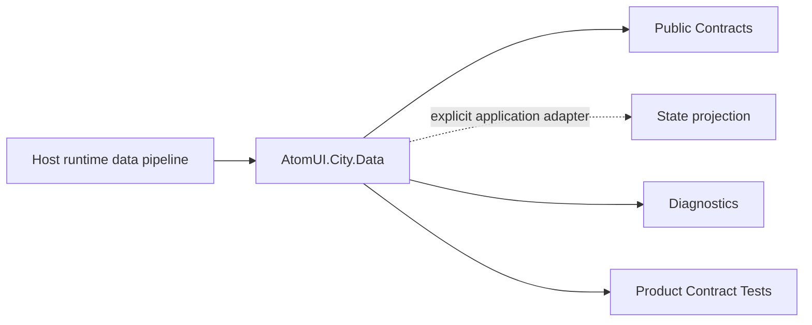

# AtomUI.City.Data Architecture

## 架构目标

AtomUI.City.Data 的架构目标是把模块职责变成可实现、可测试、可 review 的产品级合同。

- 统一 DataRequestPipeline 包装多传输。
- 显式管理连接生命周期、认证、取消、缓存、重试和错误映射。

## 核心不变量

- 每个长连接必须声明 DataConnectionOwner。
- 请求取消后不得写入 State、缓存或 UI。
- 认证在 transport 执行前完成。
- HTTP、gRPC、SignalR 统一映射到 DataResult 和 DataErrorKind。
- 缓存 key 必须包含 request identity、transport、endpoint、method、payload identity 和安全上下文相关部分。

## 核心概念和所有权

| 概念 | 职责 | 创建者 | 释放/失效规则 |
| --- | --- | --- | --- |
| DataRequest<TResponse> | 统一请求模型。 | 调用方 | 单次请求有效。 |
| DataRequestContext | operationId、transport、client、attempt、cancellation。 | Pipeline | 单次请求有效。 |
| IDataRequestPipeline | 认证、缓存、传输、重试和错误映射。 | DI | 默认 pipeline 随 DI provider；`DataModule` shutdown 先关闭 runtime gate，再停止连接。 |
| IRequestResponseTransport | HTTP/gRPC/SignalR 传输。 | DI 或 client registry | 随 DI 或 owner。 |
| DataConnectionManager | 长连接注册、启动、停止。 | DI | `DataModule` 在 Host shutdown 调用 StopAll；普通 owner 显式 StopOwner/revoke，Plugin owner 由 contribution lease 自动撤销。 |

## 产品级状态机

- Request: Created -> Authenticating -> CacheLookup -> Sending -> Mapping -> Completed 或 Failed 或 Cancelled
- Connection: Created -> Connecting -> Connected -> Reconnecting / Disconnecting -> Stopped 或 Faulted
- Stream（AUC-DATA-011/012，Completed）: Subscribed -> Active -> Completing -> Completed 或 Cancelled 或 Faulted

## 关键运行流程

- DataRequest 进入 pipeline。
- Pipeline 创建 DataRequestContext 并获取 credential。
- Cache policy 决定读取、跳过或写入。
- Transport 执行 HTTP、gRPC 或 SignalR。
- DataErrorMapper 统一映射失败。

## 失败矩阵

- credential provider 缺失、失败或 unavailable：返回 CredentialUnavailable；明确 required 时返回 AuthenticationRequired；两者都不调用 transport。
- transport timeout：返回 Timeout，诊断包含 operationId；descriptor endpoint 由 AUC-DATA-016/019 补齐。
- connection owner stop：关闭该 owner 的 connection；请求取消另由 ParentScope、plugin contribution 或 Host runtime gate 传播。
- 请求取消：返回 Cancelled，不写缓存和状态。

## 性能和资源边界

- 默认不把大 payload 全量复制多次。
- streaming/realtime 事件必须支持 backpressure 或 coalescing 扩展。

## 运行时对象模型

## 扩展点模型

- 扩展点只能通过 public API、DI、attribute、manifest、source generator 输出、MSBuild property、CLI command 或 template variable 暴露。
- 新增扩展点必须同步更新 [features.md](features.md)、[api-contracts.md](api-contracts.md)、[testing.md](testing.md) 和 [compatibility.md](compatibility.md)。
- 插件来源扩展点必须有 owner 和撤销路径。

## AOT 和 Trimming 约束

- 运行时发现能力优先通过 source generator 或 manifest。
- 产品实现不得把运行时反射扫描作为唯一发现机制。
- 生成输出和 manifest 必须稳定排序，便于 snapshot test 和增量构建。
