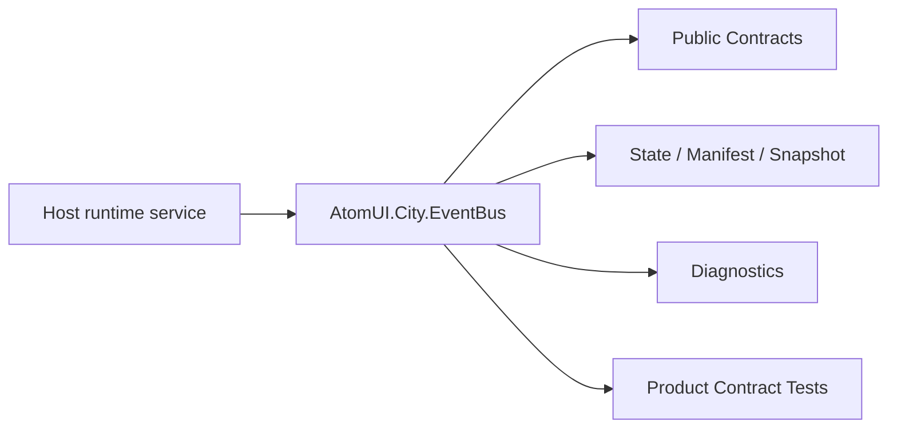

# AtomUI.City.EventBus Architecture

## 架构目标

AtomUI.City.EventBus 的架构目标是把模块职责变成可实现、可测试、可 review 的产品级合同。

- 降低模块直接引用。
- 提供可释放订阅、确定性派发、错误策略和诊断。
- 约束跨插件事件 contract 必须来自 Host 共享程序集。

## 核心不变量

- Publish 不隐式切 UI 线程。
- handler 外部代码不能在总线内部锁内执行。
- 订阅必须返回可释放句柄并绑定 owner。
- 跨插件事件类型必须来自 Host 共享 contract 程序集。
- 默认派发顺序稳定。

## 核心概念和所有权

| 概念 | 职责 | 创建者 | 释放/失效规则 |
| --- | --- | --- | --- |
| IEventBus | 发布和订阅入口。 | DI singleton | Host stop 释放订阅 registry。 |
| EventContractDescriptor | 事件类型、id、plane 和 assembly。 | 配置或插件贡献 | 不可变，可跨线程读取。 |
| EventSubscription | 可释放订阅句柄。 | Subscribe | owner dispose 或插件 unload 释放。 |
| EventPublishOptions | 派发和错误策略。 | 调用方 | 不可变或调用内复制。 |
| EventContext<TEvent> | 事件实例和 operation context。 | Publish | 单次 publish 有效。 |

## 产品级状态机

- Subscription: Created -> Active -> Disposing -> Disposed
- Publish: Created -> Dispatching -> Completed 或 Failed 或 Cancelled
- Contract registry: MutableDuringConfiguration -> FrozenAtRuntime；插件动态贡献走 snapshot 替换

## 关键运行流程

- Subscribe 验证 contract、记录 owner、创建 subscription id。
- Publish 创建 EventContext，选定 dispatch policy，按稳定顺序调用 handler。
- handler 失败按 EventErrorPolicy 继续、停止或聚合错误。
- owner dispose 或插件 unload 释放 subscription。

## 失败矩阵

- 未登记跨边界 contract：拒绝 publish 并诊断。
- handler 抛异常：记录 eventType、handlerType、operationId。
- subscription dispose 中 handler 正在执行：等待完成或按 cancellation 策略结束。
- 重复 dispose：幂等。

## 性能和资源边界

- Publish 热路径不做反射查找。
- 订阅列表使用 snapshot，publish 不持锁调用 handler。

## 运行时对象模型

## 扩展点模型

- 扩展点只能通过 public API、DI、attribute、manifest、source generator 输出、MSBuild property、CLI command 或 template variable 暴露。
- 新增扩展点必须同步更新 [features.md](features.md)、[api-contracts.md](api-contracts.md)、[testing.md](testing.md) 和 [compatibility.md](compatibility.md)。
- 插件来源扩展点必须有 owner 和撤销路径。

## AOT 和 Trimming 约束

- 运行时发现能力优先通过 source generator 或 manifest。
- 产品实现不得把运行时反射扫描作为唯一发现机制。
- 生成输出和 manifest 必须稳定排序，便于 snapshot test 和增量构建。
