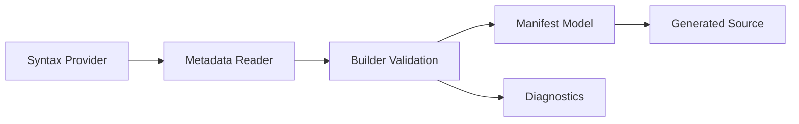

# AtomUI.City.Generators Architecture

## 架构目标

AtomUI.City.Generators 是框架 AOT 友好能力的编译期核心，负责把 attribute、partial declaration 和项目输入转换为稳定 manifest 或注册代码，减少运行时反射扫描。

- Generator target 固定为 `netstandard2.0`，作为 analyzer 分发。
- Generator 不引用 AtomUI.City 运行时包。
- 输出确定性排序，便于 snapshot test、增量构建和 review。

## 核心不变量

- 所有 discovery 结果必须来自 Roslyn semantic model、additional files 或明确 MSBuild 输入。
- 同一输入多次编译输出必须 byte-stable，除非输入变化。
- Generator diagnostic id 稳定，不能复用。
- 生成代码不能要求应用项目关闭 trimming 或 AOT。

## 核心概念和所有权

| 概念 | 职责 | 创建者 | 释放/失效规则 |
| --- | --- | --- | --- |
| AtomUICityIncrementalGenerator | Roslyn 增量入口，组合各 feature pipeline。 | 编译器 | 单次 compilation 生命周期。 |
| MetadataReader | 从语法和语义模型读取声明。 | 对应 feature pipeline | 输入变化时重新计算。 |
| ManifestBuilder | 校验、排序并输出 manifest model。 | 对应 feature pipeline | result 不可变。 |
| SourceBuilder | 生成 C# 注册代码或 manifest accessor。 | 对应 feature pipeline | generated source 由编译器持有。 |
| GeneratorDiagnostic | 编译期错误、警告和信息。 | reader/builder/source builder | 编译输出的一部分。 |

## Feature Pipeline

## 失败矩阵

| 场景 | 行为 | 必须测试 |
| --- | --- | --- |
| 模块依赖循环 | 输出 diagnostic，不生成不完整 graph。 | ModuleDependencyGraphBuilderTests |
| 服务注册 lifetime 冲突 | 输出 diagnostic，manifest 标记失败。 | ServiceRegistrationManifestBuilderTests |
| route 模板非法 | 输出 routing diagnostic，route manifest 失败。 | RouteManifestBuilderTests |
| 插件 manifest 缺少 required metadata | 输出 plugin diagnostic。 | PluginManifestBuilderTests |
| presentation view 构造函数不明确 | 输出 view diagnostic，不生成注册代码。 | PresentationViewManifestBuilderTests |
| localization resource 重复 key | 输出 localization diagnostic。 | LocalizationManifestBuilderTests |

## 性能和资源边界

Generator 必须避免全编译扫描式 LINQ 聚合成为默认路径。reader 只订阅相关 attribute 或 additional file；builder 使用稳定排序并最小化分配；测试必须覆盖 incremental update 不重新生成无关 feature。

## AOT 和 Trimming 约束

Generator 生成的是运行时显式注册和 manifest，不是 runtime reflection helper。新增运行时 discovery 功能时，必须优先设计 generator 输入和 generated output，再设计 runtime fallback。
