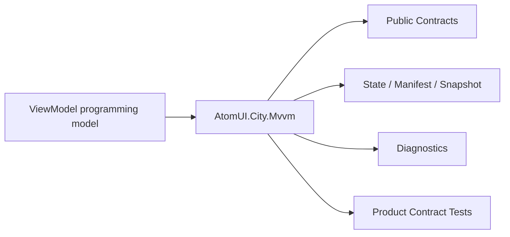

# AtomUI.City.Mvvm Architecture

## 架构目标

AtomUI.City.Mvvm 的架构目标是把模块职责变成可实现、可测试、可 review 的产品级合同。

- 建立推荐 MVVM 基类和生命周期接口。
- 复用 CommunityToolkit.Mvvm。

## 核心不变量

- MVVM 不依赖具体 View 或 Avalonia visual。
- Interaction 只表达请求，UI 展示由 Presentation handler 完成。
- Command 状态支持完成、取消、异常和并发拒绝结果。

## 核心概念和所有权

| 概念 | 职责 | 创建者 | 释放/失效规则 |
| --- | --- | --- | --- |
| ViewModelBase | 属性通知、IDisposable 释放入口和 disposed 状态。 | 应用或 DI | Dispose 幂等释放当前 ActivationScope；释放后 mutation 抛 `ObjectDisposedException`。 |
| ActivationScope | ViewModel 激活边界、取消 token 和诊断 scope id。 | Presentation/MVVM | Deactivate 或 Dispose；重复释放幂等。 |
| Interaction | ViewModel 请求 UI 交互。 | ViewModel | handler 完成释放。 |

## 产品级状态机

- ViewModel: Created -> Activating -> Active -> Deactivating -> Inactive -> Disposed
- Command: Idle -> Executing -> Completed 或 Failed 或 Cancelled

## 关键运行流程

- Presentation 创建或解析 ViewModel。
- ActivationScope 调用 IActivatable。
- CommandFactory 创建 command。
- Interaction 由 handler 返回结果。

## 失败矩阵

- CanDeactivate 拒绝：导航或关闭中止。
- DeactivationGuard 异常：返回 Failed result，不让业务异常泄漏到 UI。
- Command 抛异常：OperationResult Failed。
- Command 并发执行：OperationResult Rejected，当前执行不被取消。
- Interaction 无 handler：返回 Failed。

## 性能和资源边界

- Property notification 不做阻塞 IO。
- CanExecute 轻量。

## 运行时对象模型

## 扩展点模型

- 扩展点只能通过 public API、DI、attribute、manifest、source generator 输出、MSBuild property、CLI command 或 template variable 暴露。
- 新增扩展点必须同步更新 [features.md](features.md)、[api-contracts.md](api-contracts.md)、[testing.md](testing.md) 和 [compatibility.md](compatibility.md)。
- 插件来源扩展点必须有 owner 和撤销路径。

## AOT 和 Trimming 约束

- 运行时发现能力优先通过 source generator 或 manifest。
- 产品实现不得把运行时反射扫描作为唯一发现机制。
- 生成输出和 manifest 必须稳定排序，便于 snapshot test 和增量构建。
