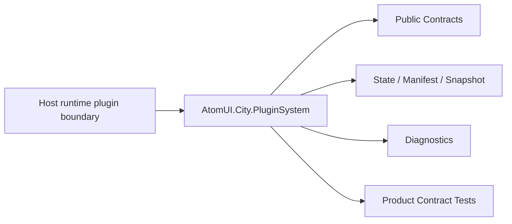

# AtomUI.City.PluginSystem Architecture

## 架构目标

AtomUI.City.PluginSystem 的架构目标是把模块职责变成可实现、可测试、可 review 的产品级合同。

- 让插件以独立 NuGet 包发布，默认一个主 assembly。
- 让 Host 可以在运行时发现、安装、加载、启用、停用和卸载插件。
- 让插件贡献可索引、可撤销、可诊断、可兼容性检查。
- 用 MSBuild 属性和 manifest 生成简化插件开发和打包。

## 核心不变量

- 插件包安装必须先进入 staging，校验成功后原子切换到 installed。
- 插件运行时入口默认一个主 assembly。
- 插件贡献必须有 lease，卸载先 revoke contribution 再释放插件对象。
- 跨插件边界类型必须位于 Host 共享 contract 程序集。
- 插件卸载失败不能破坏 Host，必须进入 UnloadPending 或失败结果。
- 安装路径必须防止路径穿越。

## 核心概念和所有权

| 概念 | 职责 | 创建者 | 释放/失效规则 |
| --- | --- | --- | --- |
| PluginManifest | 不执行插件代码即可读取的插件清单。 | MSBuild/generator 或 package reader | 作为不可变 descriptor 使用。 |
| PluginInstallation | 安装记录和安装目录。 | PluginPackageInstaller | 安装失败清理 staging。 |
| PluginDescriptor | 插件身份、版本、主程序集和 capability。 | Manifest reader/loader | 随 plugin runtime 释放。 |
| PluginRuntime | 插件加载状态和 owner。 | PluginLoader | Disable/Unload 释放。 |
| ContributionManifest | 插件声明的 route/view/state/event/data/security/resource 贡献。 | Generator 或 manifest reader | 通过 contribution lease 撤销。 |

## 产品级状态机

- Install: NotInstalled -> Staging -> Installed 或 RolledBack
- Runtime: Discovered -> Loaded -> Enabled -> Disabling -> Disabled -> Unloading -> Unloaded
- Unload failure: Unloading -> UnloadPending -> Unloaded
- Contribution: Declared -> Applied -> Revoking -> Revoked

## 关键运行流程

- Install 校验 package layout、manifest、签名、依赖和路径。
- Load 创建插件运行时 owner，读取 manifest 和主 assembly。
- Enable 应用 module 和 contribution manifest，不修改 Host root provider。
- Disable 取消插件 operation，撤销 route/view/state/event/resource/data/security contribution。
- Unload 释放插件对象并验证 remaining references。

## 失败矩阵

- manifest 缺失或 schema 不兼容：拒绝安装或加载。
- 依赖缺失或版本不满足：插件保持 Installed，不进入 Enabled。
- 贡献撤销失败：继续撤销其他贡献并报告 UnloadPending。
- 路径穿越或包布局非法：拒绝安装并清理 staging。

## 性能和资源边界

- 插件扫描必须可取消，不能阻塞 UI 线程。
- 已安装插件索引使用 manifest cache。
- 卸载重试有上限和诊断，不无限等待 GC。

## 运行时对象模型

## 扩展点模型

- 扩展点只能通过 public API、DI、attribute、manifest、source generator 输出、MSBuild property、CLI command 或 template variable 暴露。
- 新增扩展点必须同步更新 [features.md](features.md)、[api-contracts.md](api-contracts.md)、[testing.md](testing.md) 和 [compatibility.md](compatibility.md)。
- 插件来源扩展点必须有 owner 和撤销路径。

## AOT 和 Trimming 约束

- 运行时发现能力优先通过 source generator 或 manifest。
- 产品实现不得把运行时反射扫描作为唯一发现机制。
- 生成输出和 manifest 必须稳定排序，便于 snapshot test 和增量构建。
