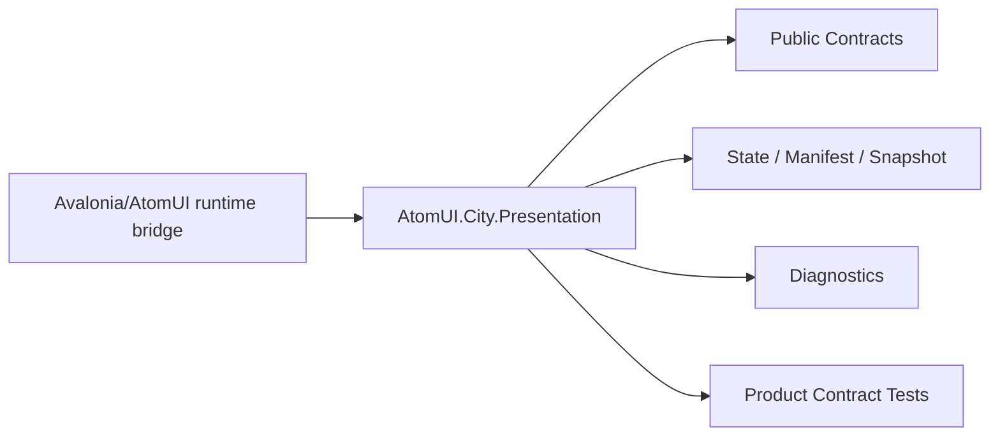

# AtomUI.City.Presentation Architecture

## 架构目标

AtomUI.City.Presentation 的架构目标是把模块职责变成可实现、可测试、可 review 的产品级合同。

- 完成 ViewModel Target -> View -> Outlet -> VisualTree。
- 统一 UI Dispatcher、ViewLocator、ViewRegistry 和 RouteOutlet。

## 核心不变量

- 所有 VisualTree 修改必须在 UI dispatcher 上执行。
- ViewLocator 默认使用 generated manifest 或显式注册。
- 插件 View、resource dictionary、localized binding 必须绑定 plugin lease。
- VisualTree 变化必须反馈到 ViewModel/State。

## 核心概念和所有权

| 概念 | 职责 | 创建者 | 释放/失效规则 |
| --- | --- | --- | --- |
| AvaloniaUiDispatcher | UI 线程调度。 | Presentation startup | Host stop 释放。 |
| ViewRegistry | View manifest 和显式注册。 | DI/generator | 插件 view revoke 更新。 |
| RouteOutlet | 提交 View 到容器。 | UI runtime | Dispose detach。 |

## 产品级状态机

- PresentationRuntime: Created -> Starting -> Running -> Stopping -> Stopped -> Disposed
- RouteOutlet: Empty -> Preparing -> Committing -> Committed 或 Failed

## 关键运行流程

- Routing 输出 ViewModelTargetDescriptor。
- ViewLocator 找到 ViewDescriptor。
- ViewFactory 创建 View。
- RouteOutlet 在 UI dispatcher 上提交 View。

## 失败矩阵

- View 未注册：返回失败并诊断。
- 非 UI 线程提交：拒绝并诊断。
- View 创建失败：不替换现有 outlet。
- 插件卸载 active view：detach 并撤销资源。

## 性能和资源边界

- ViewLocator registry lookup 接近 O(1)。
- RouteOutlet commit 不做阻塞 IO。

## 运行时对象模型

## 扩展点模型

- 扩展点只能通过 public API、DI、attribute、manifest、source generator 输出、MSBuild property、CLI command 或 template variable 暴露。
- 新增扩展点必须同步更新 [features.md](features.md)、[api-contracts.md](api-contracts.md)、[testing.md](testing.md) 和 [compatibility.md](compatibility.md)。
- 插件来源扩展点必须有 owner 和撤销路径。

## AOT 和 Trimming 约束

- 运行时发现能力优先通过 source generator 或 manifest。
- 产品实现不得把运行时反射扫描作为唯一发现机制。
- 生成输出和 manifest 必须稳定排序，便于 snapshot test 和增量构建。
