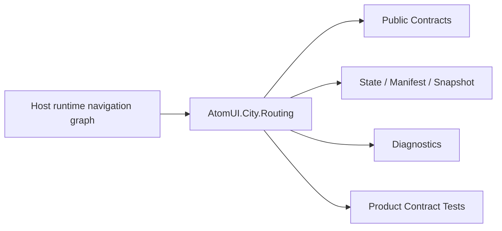

# AtomUI.City.Routing Architecture

## 架构目标

AtomUI.City.Routing 的架构目标是把模块职责变成可实现、可测试、可 review 的产品级合同。

- 声明式路由生成 AOT 友好的 RouteGraph。
- 事务式导航、参数绑定、Guard 和历史记录。

## 核心不变量

- Routing 只负责 Route -> ViewModel Target。
- RouteGraphSnapshot 发布后不可变。
- 导航是事务，失败不提交半导航。
- 插件路由撤销必须发布新 graph。

## 核心概念和所有权

| 概念 | 职责 | 创建者 | 释放/失效规则 |
| --- | --- | --- | --- |
| RouteTemplate | 路径模板和参数约束。 | attribute/generator/runtime parser | 不可变。 |
| RouteGraphSnapshot | 不可变路由图。 | builder 发布 | superseded 后只读。 |
| NavigationScope | 一次导航事务。 | Router/Host | dispose 释放。 |

## 产品级状态机

- RouteGraph: Building -> Validated -> Published -> Superseded
- Navigation: Created -> Matching -> Guarding -> Resolving -> TargetReady -> Committed 或 Cancelled 或 Failed

## 关键运行流程

- Route declaration 进入 graph builder。
- RouteMatcher 在 immutable graph 上匹配。
- NavigationScope 执行 guard 和 resolver。
- 成功输出 NavigationTarget。

## 失败矩阵

- 模板语法错误：graph build 失败。
- 路由冲突：拒绝发布 graph。
- 参数绑定失败：NavigationResult Failed。
- Guard 拒绝或重定向。

## 性能和资源边界

- Route matching 不重新解析所有模板。
- Navigation journal 有容量策略。

## 运行时对象模型

## 扩展点模型

- 扩展点只能通过 public API、DI、attribute、manifest、source generator 输出、MSBuild property、CLI command 或 template variable 暴露。
- 新增扩展点必须同步更新 [features.md](features.md)、[api-contracts.md](api-contracts.md)、[testing.md](testing.md) 和 [compatibility.md](compatibility.md)。
- 插件来源扩展点必须有 owner 和撤销路径。

## AOT 和 Trimming 约束

- 运行时发现能力优先通过 source generator 或 manifest。
- 产品实现不得把运行时反射扫描作为唯一发现机制。
- 生成输出和 manifest 必须稳定排序，便于 snapshot test 和增量构建。
