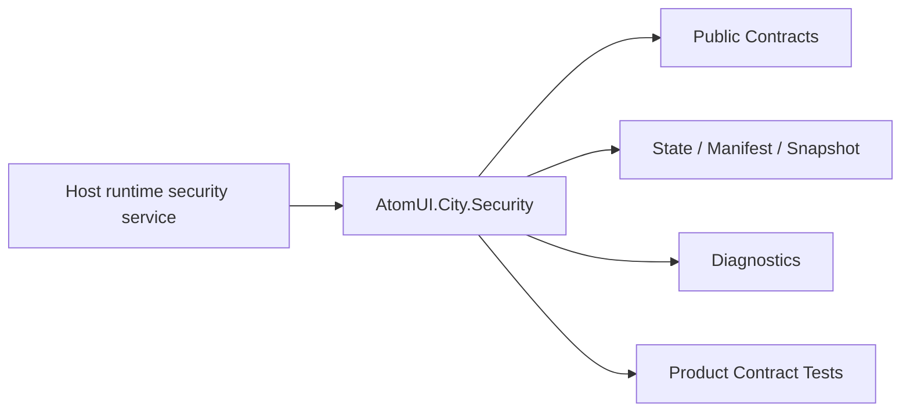

# AtomUI.City.Security Architecture

## 架构目标

AtomUI.City.Security 的架构目标是把模块职责变成可实现、可测试、可 review 的产品级合同。

- 集中表达当前用户和认证状态。
- 统一权限、策略、路由和命令授权。

## 核心不变量

- Security 不实现登录 UI。
- 认证状态以 immutable snapshot 发布。
- 授权评估不操作 UI 或导航。
- access token 失败返回 AccessTokenResult。

## 核心概念和所有权

| 概念 | 职责 | 创建者 | 释放/失效规则 |
| --- | --- | --- | --- |
| AuthenticationStateSnapshot | principal 和状态快照。 | AuthenticationStateStore | 不可变。 |
| PermissionRegistry | 权限定义注册表。 | DI | Host/plugin owner 管理。 |
| AuthorizationEvaluator | 策略评估。 | DI | 无状态。 |

## 产品级状态机

- Authentication: Unknown -> Anonymous 或 Authenticated -> Refreshing -> Authenticated 或 Anonymous
- Authorization: Created -> Evaluating -> Succeeded 或 Failed

## 关键运行流程

- AuthenticationStateStore 发布 snapshot。
- PermissionRegistry 注册 permission。
- AuthorizationEvaluator 评估 policy。
- RouteGuard 映射 result。

## 失败矩阵

- 权限未注册：授权失败。
- policy provider 缺失：返回 Failed。
- token provider 不可用。

## 性能和资源边界

- 权限查找使用 registry 索引。
- AuthorizationEvaluator 不做网络 IO。

## 运行时对象模型

## 扩展点模型

- 扩展点只能通过 public API、DI、attribute、manifest、source generator 输出、MSBuild property、CLI command 或 template variable 暴露。
- 新增扩展点必须同步更新 [features.md](features.md)、[api-contracts.md](api-contracts.md)、[testing.md](testing.md) 和 [compatibility.md](compatibility.md)。
- 插件来源扩展点必须有 owner 和撤销路径。

## AOT 和 Trimming 约束

- 运行时发现能力优先通过 source generator 或 manifest。
- 产品实现不得把运行时反射扫描作为唯一发现机制。
- 生成输出和 manifest 必须稳定排序，便于 snapshot test 和增量构建。
