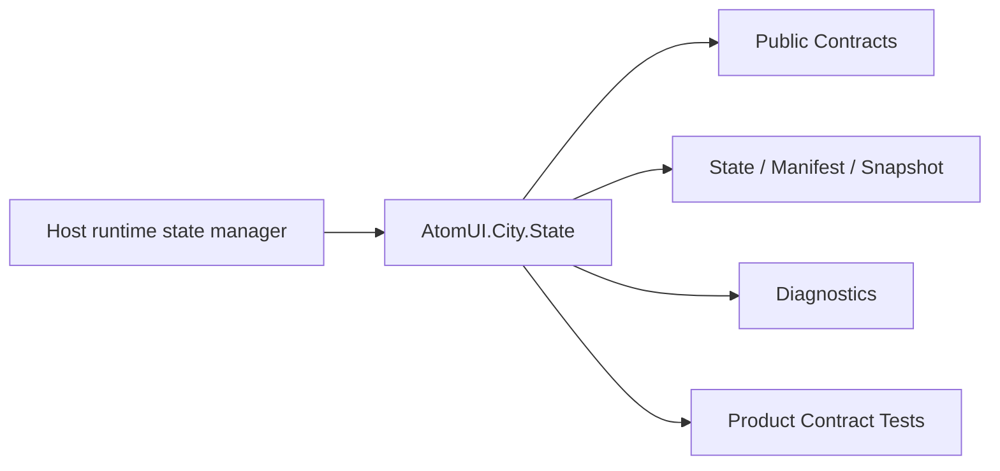

# AtomUI.City.State Architecture

## 架构目标

AtomUI.City.State 的架构目标是把模块职责变成可实现、可测试、可 review 的产品级合同。

- 让状态可通过 DI 获取并显式更新。
- 让状态变更通知可控制调度和生命周期。
- 让桌面多线程环境中的状态一致性可测试。

## 核心不变量

- 状态写入先完成原子提交，再通知订阅者。
- 默认不隐式切 UI 线程。
- StateSnapshot 创建后不可变。
- ComputedState 不能形成循环依赖。
- 插件 state definition、subscription 和 snapshot provider 必须绑定插件 owner。

## 核心概念和所有权

| 概念 | 职责 | 创建者 | 释放/失效规则 |
| --- | --- | --- | --- |
| StateKey<T> | 稳定状态键。 | 模块或插件声明 | 不可变。 |
| IWritableState<T> | 可写状态。 | State registry 或 scope | scope dispose 释放。 |
| IComputedState<T> | 派生状态。 | ComputedState factory | dispose 释放依赖订阅。 |
| StateSnapshot | 状态快照。 | Snapshot API | 不可变，可跨线程读取。 |

## 产品级状态机

- StateScope: Created -> Active -> Disposing -> Disposed
- WritableState: Registered -> Active -> Disposed
- Subscription: Active -> Disposed
- Snapshot: Created -> Immutable

## 关键运行流程

- Register 定义 StateKey、lifetime、default value、access policy 和 snapshot policy。
- Set 检查 access policy，原子更新 value 和 version。
- Notify 根据 dispatch policy 调用订阅者。
- Snapshot 按 scope/policy 捕获不可变条目。

## 失败矩阵

- 未注册 key：抛 StateNotRegisteredException 并诊断。
- 写入只读 state：抛 StateAccessDeniedException。
- 订阅回调失败：记录 subscriptionId，不回滚已提交状态。

## 性能和资源边界

- 高频 update 不全量复制所有状态。
- 订阅通知不在持锁状态调用用户代码。

## 运行时对象模型

## 扩展点模型

- 扩展点只能通过 public API、DI、attribute、manifest、source generator 输出、MSBuild property、CLI command 或 template variable 暴露。
- 新增扩展点必须同步更新 [features.md](features.md)、[api-contracts.md](api-contracts.md)、[testing.md](testing.md) 和 [compatibility.md](compatibility.md)。
- 插件来源扩展点必须有 owner 和撤销路径。

## AOT 和 Trimming 约束

- 运行时发现能力优先通过 source generator 或 manifest。
- 产品实现不得把运行时反射扫描作为唯一发现机制。
- 生成输出和 manifest 必须稳定排序，便于 snapshot test 和增量构建。
