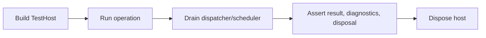

# AtomUI.City.Testing Architecture

## 架构目标

AtomUI.City.Testing 是测试专用框架包，为框架自身和使用者提供 Host、Module、Plugin、Routing、Source Generator、UI Dispatcher、AOT 和 diagnostics 的可重复测试工具。

- 生产项目不得引用 Testing。
- 测试不依赖固定 `Task.Delay`。
- 生命周期、线程、插件卸载、dispatcher 和 generated output 都有可断言工具。

## 核心不变量

- Testing 包只能被测试项目引用，Build 门禁负责阻止 runtime 项目引用。
- Fake dispatcher 和 deterministic scheduler 必须可手动推进。
- Test host 必须暴露 diagnostics、records、disposable tracker 和失败上下文。
- Source generation test kit 必须支持 snapshot 和 diagnostic assertion。

## 核心概念和所有权

| 概念 | 职责 | 创建者 | 释放/失效规则 |
| --- | --- | --- | --- |
| TestHost | 通用测试 Host、服务和诊断记录。 | TestHostBuilder | 测试结束 Dispose。 |
| ModuleTestHost | 模块依赖、生命周期和服务注册测试。 | ModuleTestHostBuilder | 测试结束 Dispose。 |
| PluginTestHost | 插件安装、加载、卸载和贡献撤销测试。 | PluginTestHostBuilder | 测试结束 Dispose。 |
| RoutingTestHost | route graph、match 和 navigation 测试。 | RoutingTestHostBuilder | 测试结束 Dispose。 |
| FakeUiDispatcher | 可控 UI dispatcher。 | 测试代码 | 测试结束 Dispose。 |
| DeterministicScheduler | 手动推进异步和延迟任务。 | 测试代码 | 测试结束 Dispose。 |
| SourceGenerationTestCase | generator 输入、输出和 diagnostics。 | 测试代码 | 单次测试只读。 |

## 测试运行流程

## 失败矩阵

| 场景 | 行为 | 必须测试 |
| --- | --- | --- |
| 测试忘记释放 scope 或 subscription | DisposableTracker 失败。 | SharedTestUtilitiesTests |
| UI work 未 drain | FakeUiDispatcher 暴露 pending work。 | FakeUiDispatcherTests |
| generator 输出变化 | snapshot assertion 失败并显示 source name。 | SourceGenerationTestKitTests |
| 插件卸载后仍有 contribution | PluginTestHost 失败。 | PluginTestHostTests |
| AOT 禁止模式被使用 | AotCompatibilityCheck 返回 diagnostic。 | AotCompatibilityCheckTests |

## 与其他模块关系

Testing 可以引用框架运行时模块来构造测试工具；运行时模块不得反向引用 Testing。新增模块必须至少提供 unit test helper 或明确说明复用哪个 Testing 工具。
